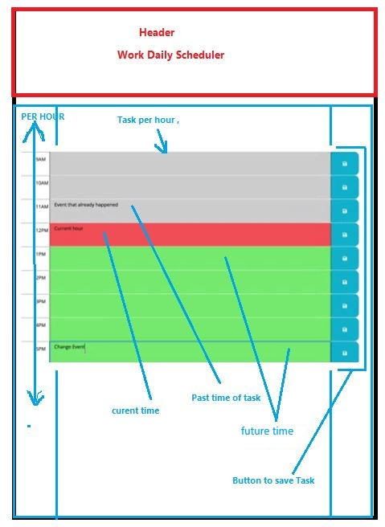

# My Scheduler

## Description
Create task scheduler for present day with business hours

## Build site using
* HTML
* CSS
* JS
* Moment.JS
* JQuery

## Project challanges
* style HTML page from code
* color tasks differently by time status (past,present and future) .
* Save task in local storage
* Get saved tasks data from local storage

## Project screen shots

## Project web link
[web site link](https://lakicode.github.io/MySheduler/)

## web site deveper
Made by Robert Fuke @June 2021
